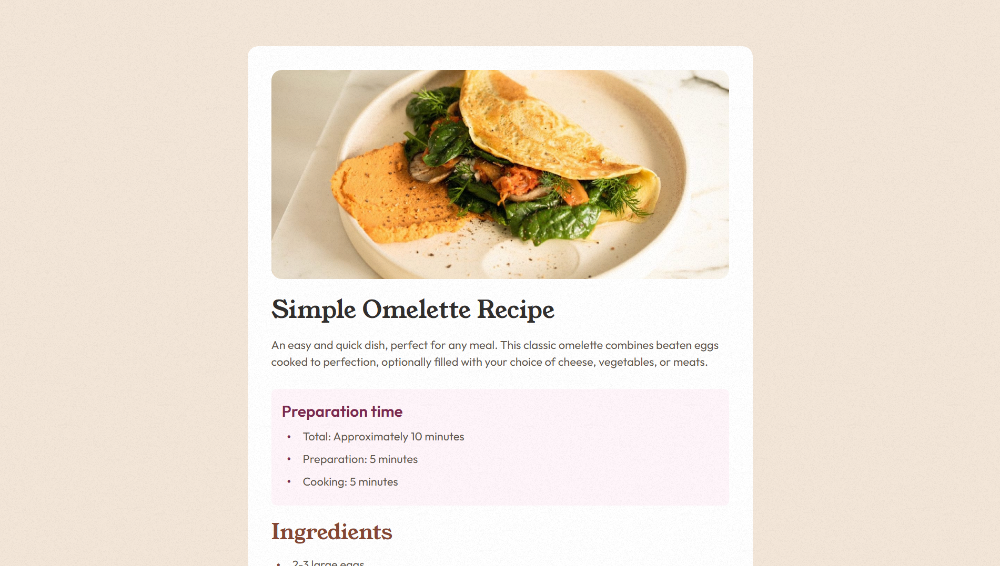
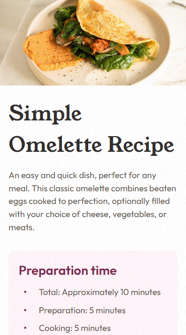

# 🍳 Recipe page - Решение задачи с Frontend Mentor 🌟

Этот репозиторий содержит моё решение для задачи [Recipe Page Challenge на Frontend Mentor](https://www.frontendmentor.io/). Основной целью проекта было улучшить навыки написания семантической HTML-разметки и создания адаптивной страницы рецепта, которая корректно отображается на различных устройствах. 🚀

---

## 📋 Оглавление

- [🔍 Обзор](#-обзор)
    - [🖼 Скриншоты](#-скриншоты)
    - [🔗 Ссылки](#-ссылки)
- [⚙️ Мой процесс](#-мой-процесс)
    - [🛠 Используемые технологии](#-используемые-технологии)
    - [📚 Что я узнал](#-что-я-узнал)
- [👨‍💻 Автор](#-автор)

---

## 🔍 Обзор

### 🖼 Скриншоты

#### Десктоп

#### Мобильная версия

### 🔗 Ссылки

- [📂 Репозиторий](https://github.com/Hamptooon/recipe-page)
- [🌐 Живая версия](https://Hamptooon.github.io/recipe-page)

---

## ⚙️ Мой процесс

### 🛠 Используемые технологии

- ✅ **Семантический HTML5** для структурированной и осмысленной разметки.
- 🎨 **CSS Flexbox** для создания гибких макетов.
- 📱 **Адаптивный дизайн** с использованием медиа-запросов и функций, таких как `clamp()`, для плавного масштабирования на разных устройствах.
- 🧩 **SCSS-архитектура 7-1** для модульной и организованной структуры стилей.
- 🛠 **SCSS Mixins** для упрощения переиспользуемых стилей и поддержания принципа DRY.

### 📚 Что я узнал

Этот проект помог мне:

- Улучшить навыки работы с **семантическим HTML**, чтобы обеспечить правильную структуру документа.
- Освоить **адаптивный дизайн** с использованием функции **`clamp()`**, позволяющей динамически изменять размеры шрифтов и отступов.
- Организовать CSS более эффективно с помощью **SCSS-архитектуры 7-1**, что делает стили более масштабируемыми и легко поддерживаемыми.
- Использовать **SCSS Mixins** для создания переиспользуемых компонентов дизайна.

---

## 👨‍💻 Автор

- GitHub - [Hamptooon](https://github.com/Hamptooon)
- Frontend Mentor - [Hamptooon](https://www.frontendmentor.io/profile/Hamptooon)

---

🔧 Этот проект является частью моего непрерывного обучения в области front-end разработки. Не стесняйтесь форкать, вносить свой вклад или ставить звёздочку ⭐️, если проект вам понравился!